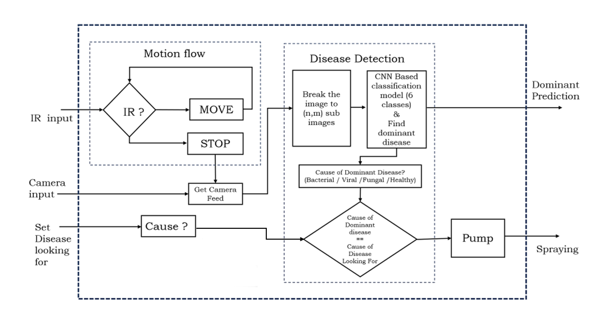
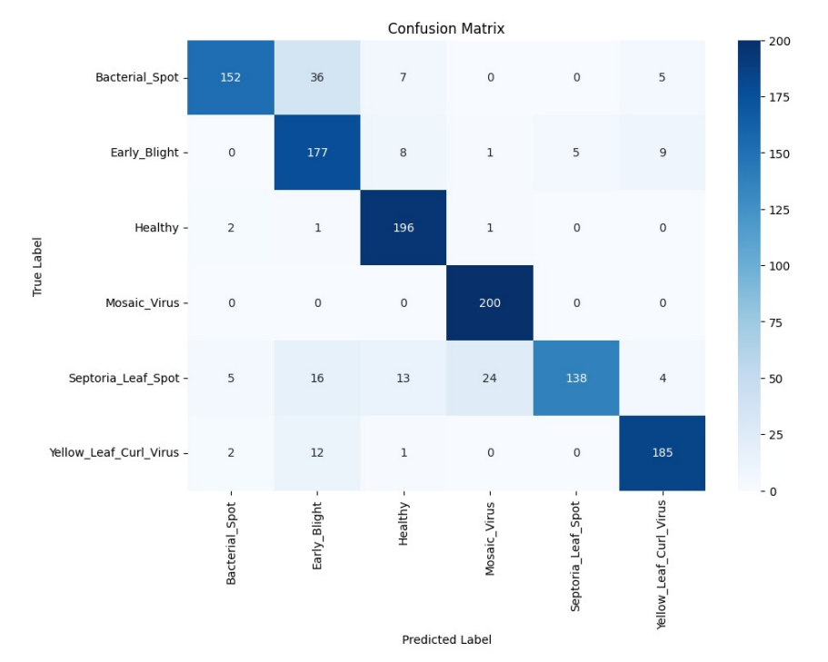

# AgroBot: Disease Detection and Pesticide Spraying Robot

This repository contains the code, model, and design for a Raspberry Pi–based robotic system that detects diseases in tomato plants grown in bags and selectively sprays pesticides based on the disease category.

---

## 🌱 Project Summary

**AgroBot** is an autonomous mobile robot developed for precision agriculture in indoor/greenhouse tomato cultivation. It uses computer vision and deep learning (CNN) to analyze plant health, identify diseases, and activate pesticide spraying when required.

---

## 🔄 System Workflow

1. Robot moves forward until a plant is detected using an IR sensor.
2. Captures a live image using a webcam.
3. Splits the image into 5×5 sub-regions.
4. Checks green pixel ratio to identify valid leaf areas.
5. Each valid patch is passed to a CNN for disease classification.
6. Most frequent class is selected as the dominant disease.
7. Based on the mapped cause (bacterial/fungal/viral), the sprayer activates.
8. The robot resumes motion to the next plant.

---

## 🧠 Deep Learning Overview

- **Model:** Custom CNN with convolutional layers, pooling, dropout, batch normalization, and dense layers.
- **Input Image:** 224×224 RGB
- **Dataset:** Tomato leaf disease dataset from Kaggle (6 classes)
- **Fragmentation:** 25 patches (5×5 grid) from captured image

### 🎯 Classification Classes

| Index | Class Name                      | Cause     |
|-------|----------------------------------|-----------|
| 0     | Bacterial Spot                  | Bacterial |
| 1     | Late Blight                     | Fungal    |
| 2     | Septoria Leaf Spot              | Fungal    |
| 3     | Tomato Yellow Leaf Curl Virus   | Viral     |
| 4     | Tomato Mosaic Virus             | Viral     |
| 5     | Healthy                         | Healthy   |

---


## 📦 System Architecture

### 🧱 System Block Diagram
The overall structure of AgroBot is shown below:



---

### 🔌 Circuit Diagram
Circuit connecting Raspberry Pi, IR sensor, motor drivers, sprayer pump, and camera:


---

## ⚙️ Hardware Components

- Raspberry Pi 4 Model B
- 2 × L298N Motor Drivers
- 4 × DC motors
- HD USB Webcam
- IR Sensor (Obstacle detection)
- DC Pump (Pesticide sprayer)
- 12V 7.5Ah Li-Ion Battery
- Buck Converter (12V → 5V)

---

## 💻 Software Stack

- **Language:** Python 3
- **Libraries:** 
  - TensorFlow 2.13.0
  - OpenCV
  - NumPy
  - RPi.GPIO

---
## 📊 Model Training and Performance Evaluation 

| Metric              | Value   |
|---------------------|---------|
| Accuracy            | 93.1%   |
| Precision           | 92.8%   |
| Recall              | 93.0%   |
| F1 Score            | 92.9%   |

---

## 🧪 Visualizations

### ✅ Confusion Matrix


### 📈 Training and Validation Curves


---

## 🚀 Setup and Execution

### 🔁 Clone This Repository

```bash
git clone https://github.com/yourusername/agrobot-disease-detector.git
cd agrobot-disease-detector
```
---

### 🔧 Prerequisites

```bash
pip install tensorflow==2.13.0 opencv-python RPi.GPIO numpy

